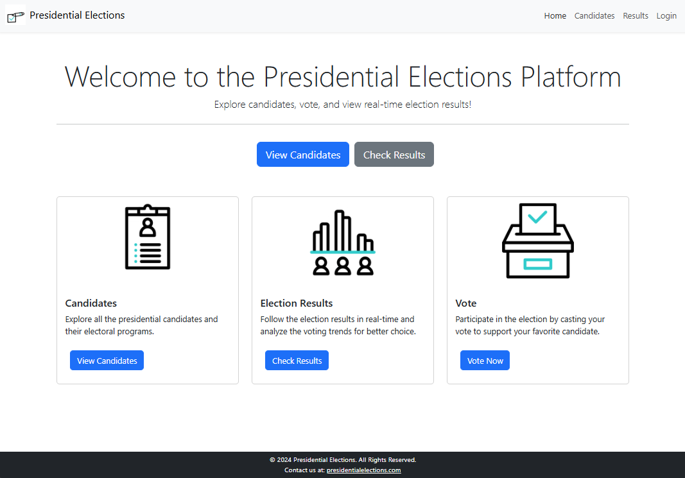
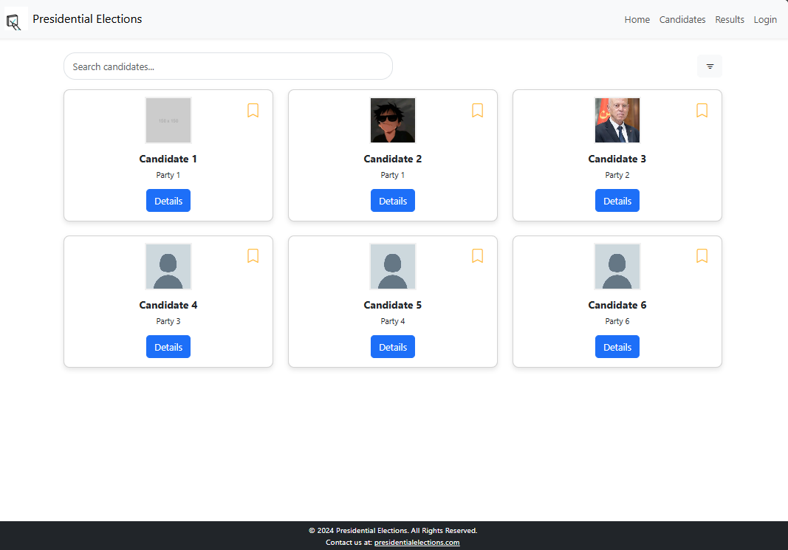
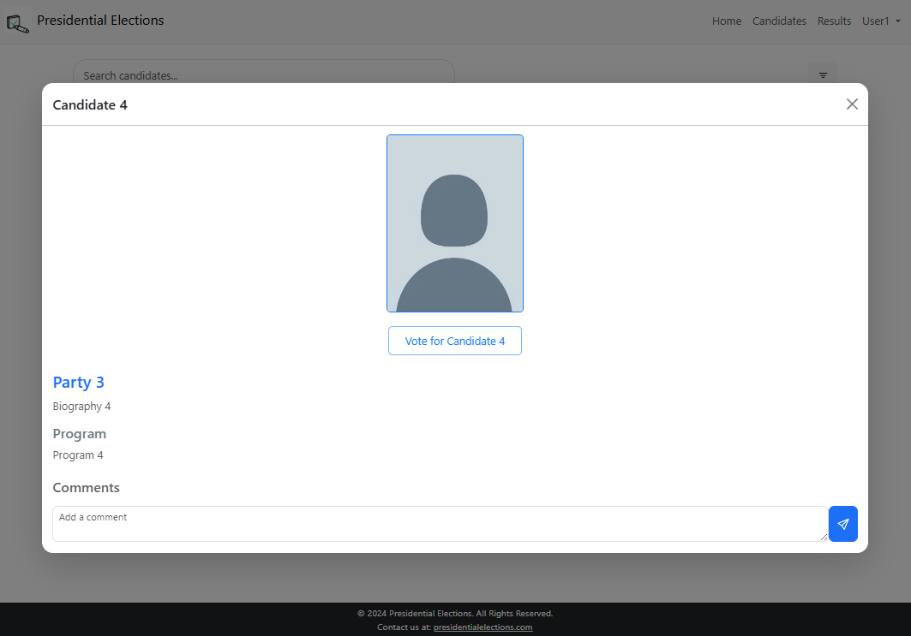
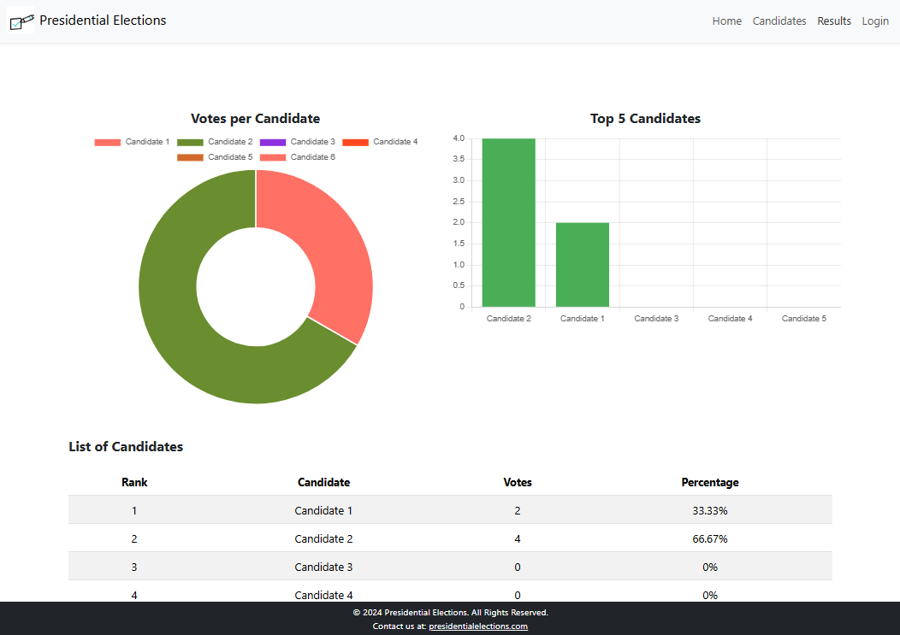
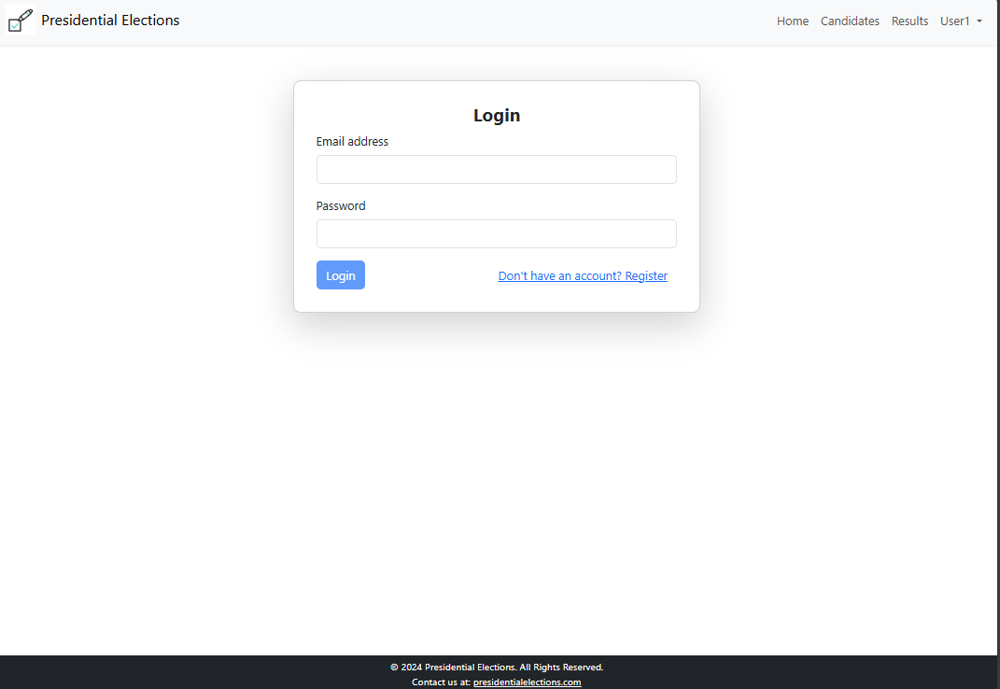
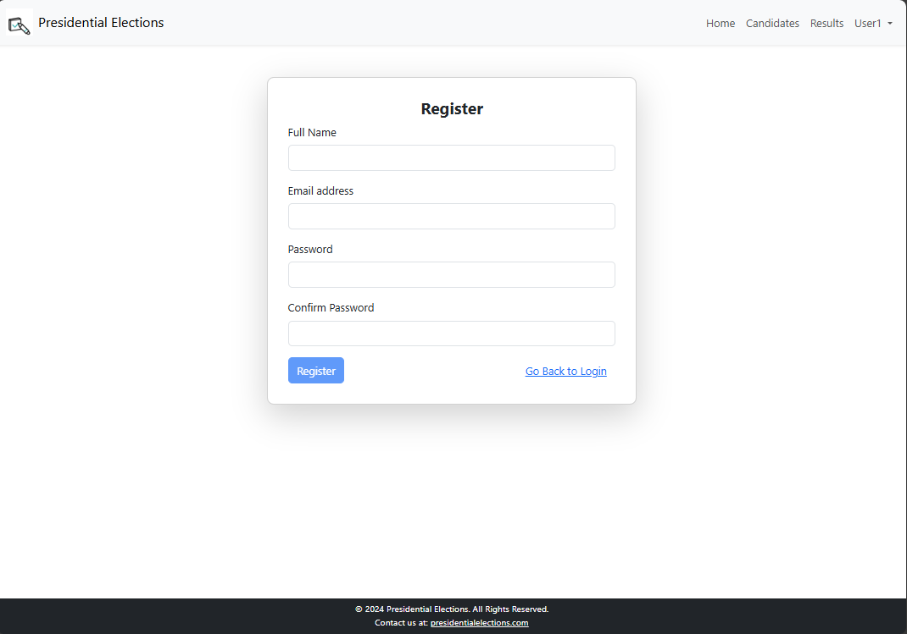
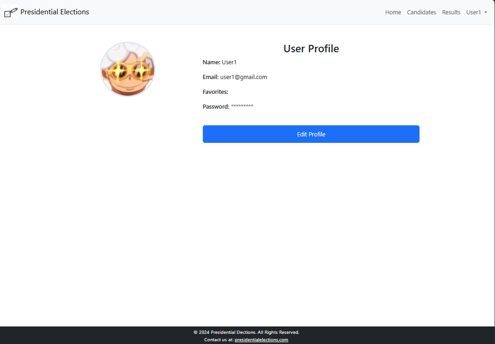
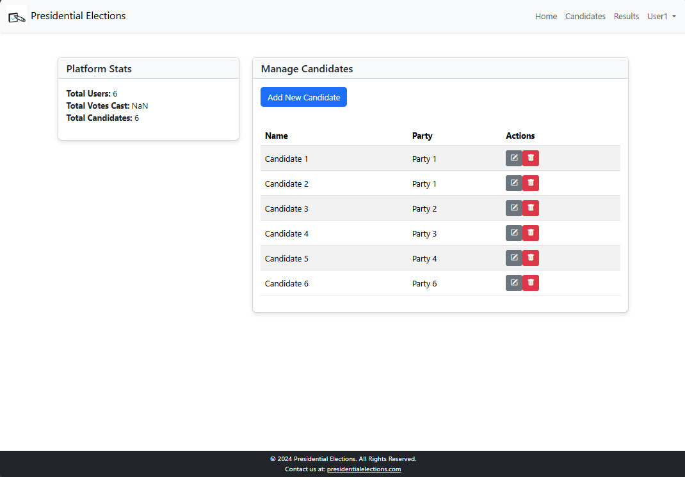

# Presidential Elections - Secure Online Voting System

A dynamic, full-stack **online voting system** for presidential elections, built with **Angular**, **Node.js**, and **MongoDB**. The system allows secure and transparent voting, ensuring integrity and privacy for all users.

---

## 🚀 **Installation and Setup**

Follow the steps below to run the project locally.

### 1. **Clone the repository**

```bash
git clone https://github.com/CodeWizard-404/Presidential-Elections.git
cd Presidential-Elections
```

### 2. **Install dependencies**

#### Frontend (Angular)

Navigate to the frontend directory and install the Angular dependencies:

```bash
cd Front-End
npm install
```

#### Backend (Node.js)

Go to the backend directory and install the necessary Node.js modules:

```bash
cd ../Back-End
npm install
```

### 3. **Set up MongoDB**

Make sure MongoDB is installed and running. You can use a local MongoDB instance or a cloud database like **MongoDB Atlas**.

1. **Start MongoDB** locally or configure it via your **MongoDB Atlas** connection string.
2. start a connection on port 27017.

### 4. **Import Election Data**

Import your election data (e.g., candidates, voter records) from the provided **JSON files** into the database.

#### Example: Importing Election Data

You can use **MongoDB Compass** or a script to load the JSON files.

In the **`Database`** section of your MongoDB setup, import the data into the appropriate collections:

```bash
# For importing elections data:
mongoimport --db GEP --collection elections --file GEP.elections.json
```

Make sure that the structure in the JSON matches your database schema (e.g., elections, candidates).

---

## 🔧 **Running the Application**

Once dependencies are installed and data is imported, you’re ready to run the project!

### 1. **Start the Backend Server**

From the **Back-End** folder, start the server:

```bash
npm start
```

By default, the backend will run on [http://localhost:3000](http://localhost:3005).

### 2. **Start the Frontend Application**

In the **Front-End** folder, run:

```bash
ng serve
```

Now, open your browser and go to [http://localhost:4200](http://localhost:4200). You should see the application running!

---

## ⚙️ **Features**

- **User Authentication**: Secure login system for voters and administrators.
- **Election Management**: Admin can create and manage elections, set candidates, and track voting progress.
- **Voting Mechanism**: Voters can cast their votes securely.
- **Real-Time Results**: Election results are automatically updated and shown to authorized users.
  
---

## 🛠 **Technologies Used**

- **Angular**: Powerful framework for dynamic, single-page applications.
- **Node.js**: Asynchronous event-driven JavaScript runtime for the backend.
- **MongoDB**: NoSQL database for flexible, scalable storage.

---

## 📜 **License**

This project is licensed under the MIT License - see the [LICENSE.md](LICENSE.md) file for details.

---

## 📸 **Screenshots**

<marquee scrollamount="10" behavior="scroll" direction="left">
  
  
  
  
  
  
  
  
  
</marquee>

---

## 💬 **Contributing**

We welcome contributions! Feel free to fork this repository and submit pull requests. If you have any suggestions or find any bugs, open an issue!

---

## 🧑‍💻 **Contact**

For any inquiries, contact me at [my Email](mailto:sofinelaghouanem.com).
